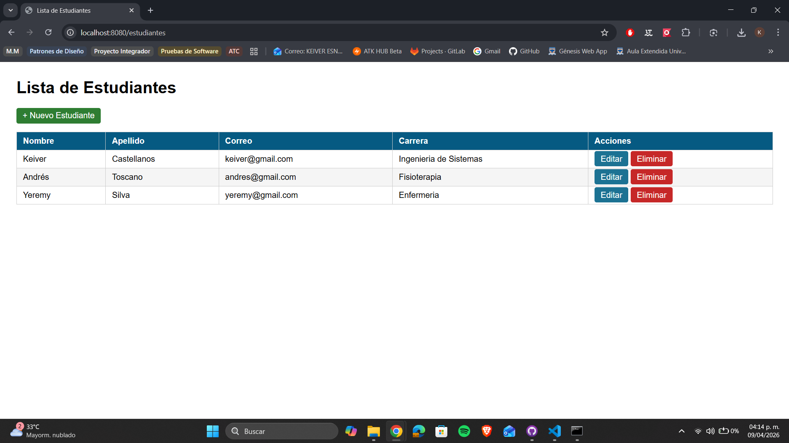
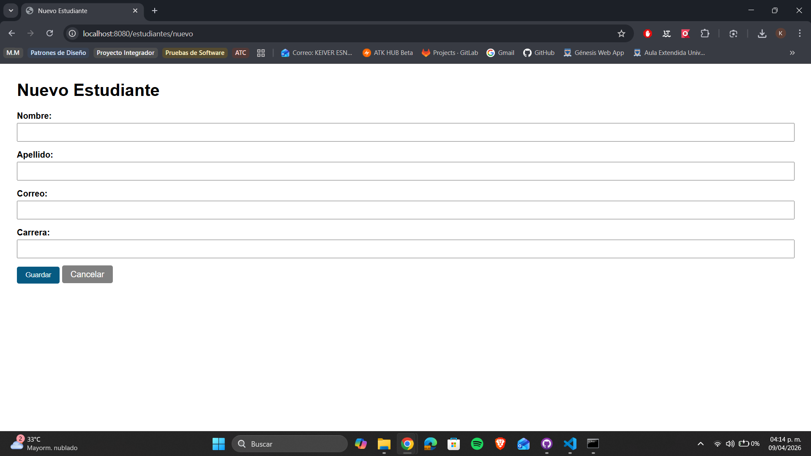
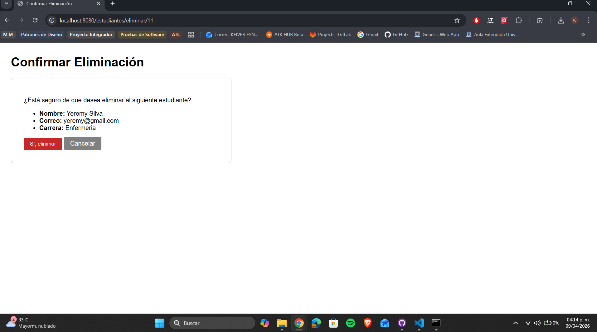
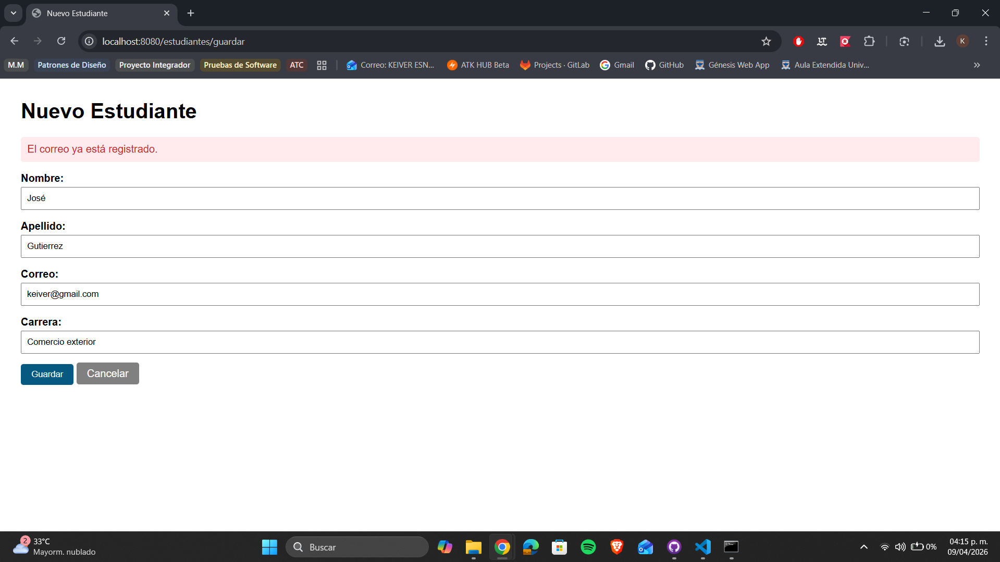
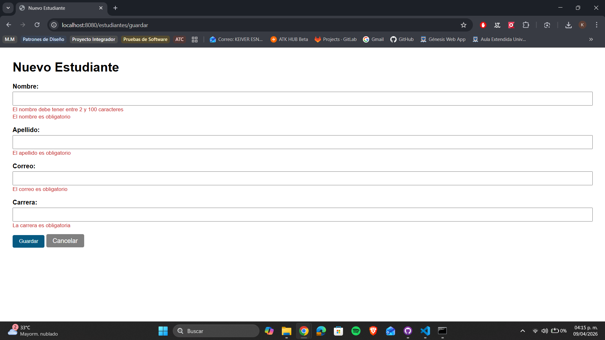
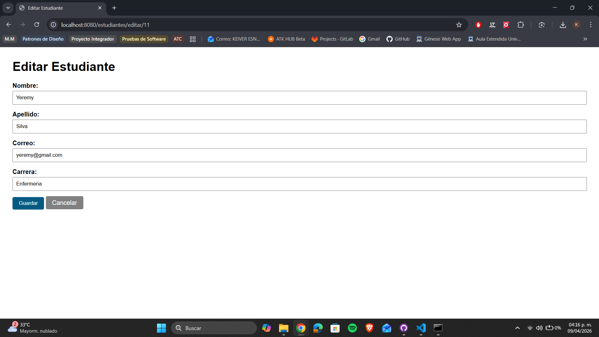

# CRUD de Estudiantes con Spring Boot y JPA/Hibernate — Post-Contenido 1 Unidad 8

> **Post-Contenido 1 — Unidad 8**

Aplicación web CRUD completa de gestión de estudiantes desarrollada con Spring Boot, Spring Data JPA e Hibernate como proveedor ORM, conectada a una base de datos MySQL. Implementa arquitectura en capas (controller, service, repository, model) con validaciones Bean Validation y persistencia real en base de datos.

## Tecnologías utilizadas

- **Java 21**
- **Spring Boot 3.5.1**
- **Spring Data JPA / Hibernate**
- **MySQL 9.6**
- **Thymeleaf**
- **Bean Validation**
- **Maven 3.9.12**

## Estructura del proyecto

```text
estudiantes/
└── src/
    └── main/
        ├── java/com/universidad/estudiantes/
        │   ├── EstudiantesApplication.java
        │   ├── model/
        │   │   └── Estudiante.java
        │   ├── repository/
        │   │   └── EstudianteRepository.java
        │   ├── service/
        │   │   └── EstudianteService.java
        │   └── controller/
        │       └── EstudianteController.java
        └── resources/
            ├── application.properties
            └── templates/
                └── estudiantes/
                    ├── lista.html
                    ├── formulario.html
                    └── confirmar-eliminar.html
```

## Requisitos previos

- **Java 17** o superior
- **Maven 3.8+**
- **MySQL 8.x** o superior instalado y en ejecución

## Configuración de la base de datos

Ejecutar en MySQL:

```sql
CREATE DATABASE estudiantes_db CHARACTER SET utf8mb4 COLLATE utf8mb4_unicode_ci;
CREATE USER 'appuser'@'localhost' IDENTIFIED BY 'apppass';
GRANT ALL PRIVILEGES ON estudiantes_db.* TO 'appuser'@'localhost';
FLUSH PRIVILEGES;
```

## Configuración de application.properties

```properties
spring.datasource.url=jdbc:mysql://localhost:3306/estudiantes_db?useSSL=false&serverTimezone=UTC&allowPublicKeyRetrieval=true
spring.datasource.username=appuser
spring.datasource.password=apppass
spring.jpa.hibernate.ddl-auto=update
spring.jpa.show-sql=true
```

## Instrucciones de ejecución

1. **Clonar el repositorio**

```bash
   git clone https://github.com/tu-usuario/castellanos-post1-u8.git
   cd castellanos-post1-u8/estudiantes
```

2. **Ejecutar la aplicación**

```bash
   mvn spring-boot:run
```

3. **Acceder a la aplicación**

   [http://localhost:8080/estudiantes](http://localhost:8080/estudiantes)

## Funcionalidades implementadas

- **Listar estudiantes:** muestra todos los registros de la base de datos
- **Crear estudiante:** formulario con validaciones Bean Validation
- **Editar estudiante:** formulario prellenado con datos del registro
- **Eliminar estudiante:** pantalla de confirmación antes de eliminar
- **Validaciones:** nombre, apellido, correo y carrera obligatorios
- **Correo único:** restricción a nivel de base de datos con manejo de error amigable
- **Persistencia real:** los datos se guardan en MySQL y persisten al reiniciar

## Capturas de pantalla

### Lista de estudiantes



### Formulario de nuevo estudiante



### Confirmación de eliminación



### Error de correo duplicado



### Validaciones de formulario vacío



### Formulario de edición



### Lista con estudiante editado


